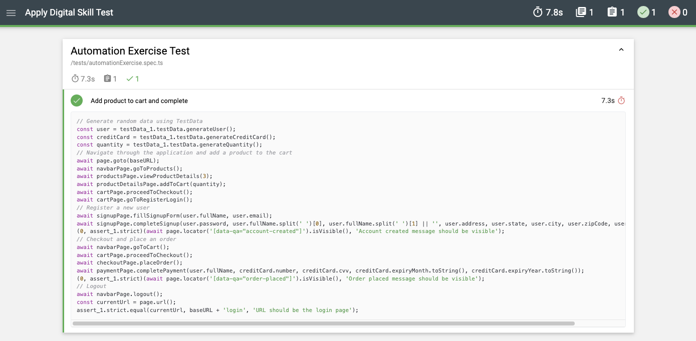
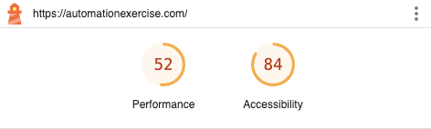

<!-- BEGINNING -->
# Framework for e2e tests in Automation Exercise

---
## **CodeOwner**
* [@tiareadc](@tiareadc)

---
## **Framework selection**
The chosen tool is Playwright because it is a robust framework, ideal for scaling and adding more tests over time. It supports cross-browser testing and device emulation, enabling thorough testing across different environments. Playwright has a strong community, detailed documentation, and modern features that simplify automation tasks. Additionally, as it is the tool I have been using recently, it aligns with my expertise, making it easier and more efficient for me to implement.

---
## **Test case document**
Test Case Name: Add Product to Cart and Complete Checkout

Preconditions
- The application is accessible at the base URL.
- Valid environment variables are set, including BASE_URL.
- The user is not logged in.
- testData utility generates valid and randomized data.

Test Steps
1. Launch the Application
- Navigate to the base URL.

2. Navigate to Products Page
- Click on the “Products” link.

3. View Product Details
- Select the details of product ID 3.

4. Enter random quantity of the selected product
- Update the quantity to a random number between 1 to 20.

5. Add Product to Cart
- Add the selected product to the cart.

6. Proceed to Checkout
- Navigate to the cart page and initiate the checkout process.

7. Register a New User
- Redirect to the registration page and create a new user with random details generated by testData.
- Verify that the “Account Created” message is displayed.

8. Place an Order
- Return to the cart and proceed to checkout.
- Complete the payment form with randomized credit card details from testData.
- Verify that the “Order Placed” message is displayed.

9. Logout of the account
- Logout and close the browser session after the test is completed.

Expected Results
- Step 1: The application’s homepage is displayed successfully.
- Step 2: The “Products” page loads with a list of products visible.
- Step 3: The product details page for the selected product (ID 3) is displayed correctly.
- Step 4: The product updated with the specified quantity.
- Step 5: The product is successfully added to the cart.
- Step 6: The cart page shows the correct product, and the checkout process is initiated without errors.
- Step 7: A new account is created successfully, and the “Account Created” message is visible.
- Step 8: The order is successfully placed, and the “Order Placed” message is displayed.
- Step 9: Logged out from the account and the browser closes cleanly.

---
## **Instructions for running the test**
1. Clone this repository to your local machine and open it in your IDE.
2. Make sure all required dependencies are installed with npm install.
3. To execute tests for desktop, use the following command: npm run test.
4. To execute tests for mobile, use the following command: npm run test:mobile.
5. To analyze the performance of the application using Lighthouse, run the following command: npm run lighthouse.

---
## **Test reporting**
•	Status of test execution: Pass

•	Lighthouse accessibility score: 84
•	Lighthouse performance score: 52

<!-- END -->